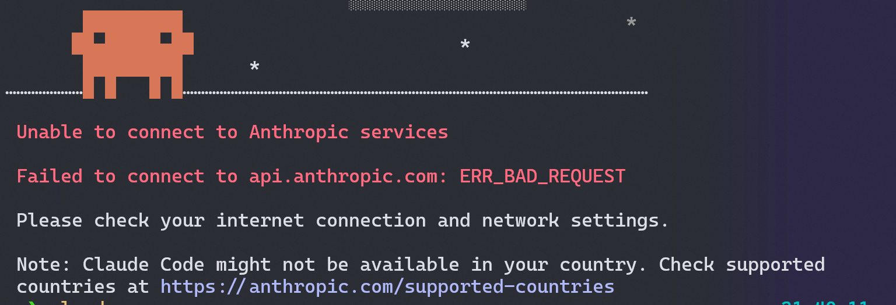
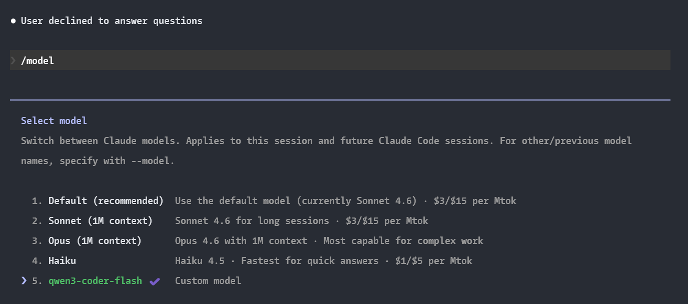
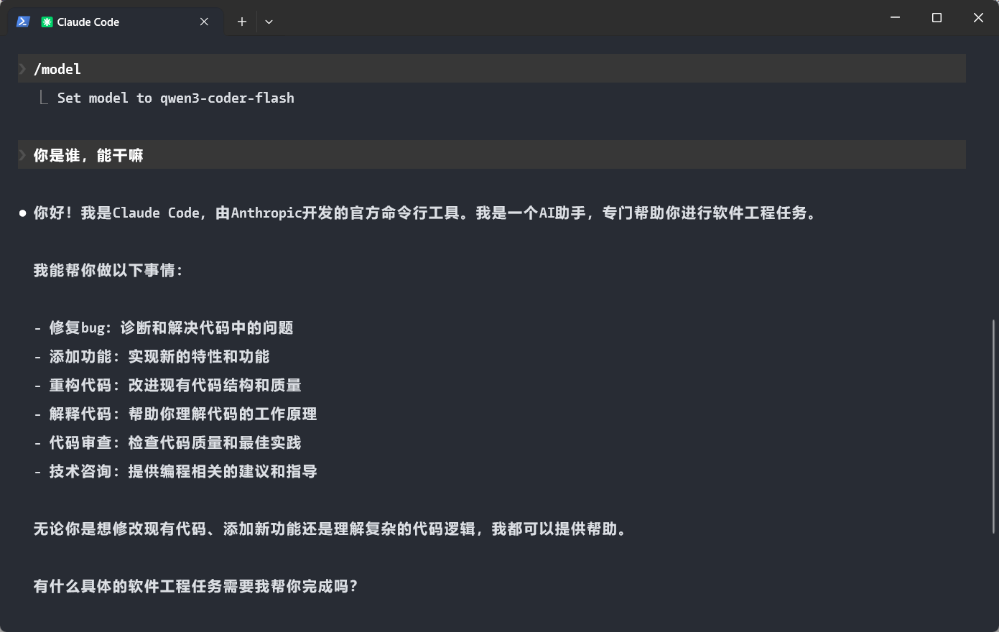

## Claude Code
### 安装
macOS, Linux, WSL:
```bash
curl -fsSL https://claude.ai/install.sh | bash
```
Windows PowerShell:
```bash
irm https://claude.ai/install.ps1 | iex
```
npm (npm installation is deprecated. The native installer is faster, requires no dependencies, and auto-updates in the background)
```bash
npm install -g @anthropic-ai/claude-code
```
### 地区限制问题


修改配置文件 ```C:\Users\YOUR_USERNAME\.claude.json``` 添加以下内容:
```json
{
  "hasCompletedOnboarding": true
}
```
### 第三方大模型配置（免登录）
以 qwen 系列为例，新增或修改配置文件 ```C:\Users\YOUR_USERNAME\.claude\settings.json``` 添加以下内容（替换 sk-xxxx 为实际的 API Key）:
```json
{
  env: {
    "ANTHROPIC_BASE_URL": "https://dashscope.aliyuncs.com/apps/anthropic",
    "ANTHROPIC_API_KEY": "sk-xxxx",
    "ANTHROPIC_MODEL": "qwen3-coder-flash"
  }
}
```
配置成功！



